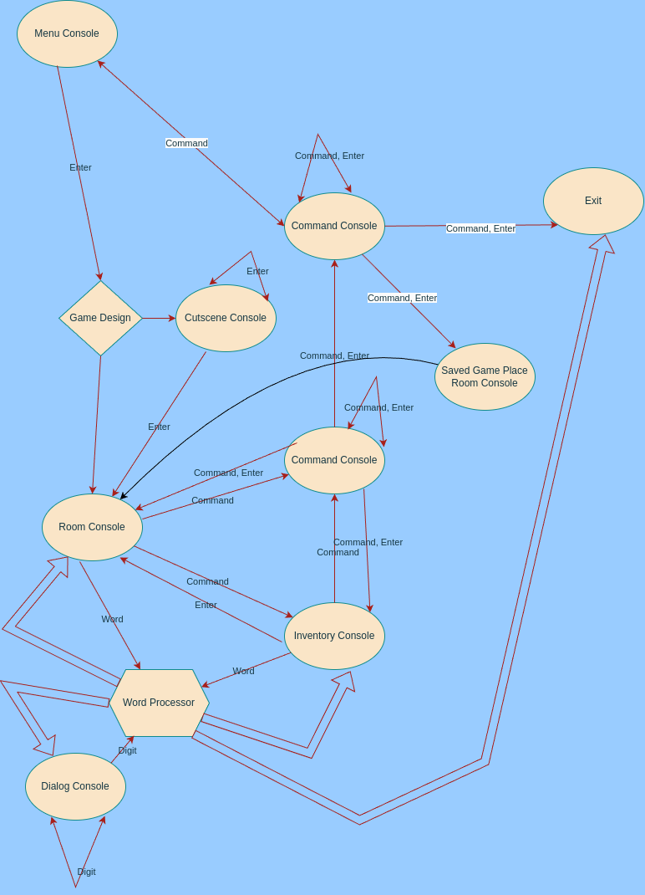

# IFENGINE

Interactive Fiction Engine.  
Game Engine for word console games.

## View

Console View

- Start Console
- Room Console
- Inventory Console

### Start Console

Sections:

- Game Head
- Game Name
- Game Description
- Menu
- Command Prompt

Examples:

```
<|><|><|><|><|><|><|><|><|>
<|>  FLOWERS AND GUNS   <|>
<|><|><|><|><|><|><|><|><|>
:Flowers & Guns
:World of Flowers & Guns wait you! Are you ready to be a Hero?!
Cut plants, fire trees, fight for fun, bite all!
Only holly Big Pig Mick can stop you. 
:Press Enter for start; 'l.' for load you save file; 'e.' or 'q.' for exit; 'h.' for help
>
```

### Room Console

Sections:

- Game name and Level Name and Room name (separate by ':')
- Room description
- Inventory short list (separate by '|')
- Command prompt

Examples:

```
:Flowers & Guns :Returning Home :Old Bridge
:On a border of two Kingdoms. There is a guard at the entrance. Colorful bird
on the high railings. A horseshoe is lying on the side. In the distance I see 
the exit. The bridge is very long and dirty.
| Bred | Knive |
>
```

#### Room Description

Room Description is dynamic text block which contains:

- Start Constant text
- Dynamic text
- End Constant text

##### Start Constant text

Examples:  
**'On a border of two Kingdoms.'**

##### Dynamic text

Dynamic text contains:

- item room descriptions [Objects.Item](#item)
- door room descriptions [Objects.Door](#inventory-description)
- player room descriptions [Objects.Player](#ifengige-objects-player)

Examples:  
**'There is a guard at the entrance. Colorful bird on the high railings. A horseshoe is lying on the side. In the
distance I see the exit.'**

We can see here:

- Player (*a guard*)
- Player (*a bird*)
- Item (*a horseshoe*)
- Door (*the exit*)

When player take an item or a player (into the inventory) the item room description disappears.

##### End Constant text

Examples:
**'The bridge is very long and dirty.'**

### Inventory Console

- List of items with theirs description
- Command prompt

Examples:

```
| Horseshoe - they say it brings good luck |
| Murble-Karbl Bird - my new frend from far far islands |
>
```

### Dialog Console

#### Player starts dialogs

- numbered choice of phrases for the player
- Command prompt

```
1. Dear guard, I have money to pay.
2. Now let me through!
3. I'll go complain to your commander.
>
```

#### Continuing dialog

- chosen player's phrase
- npc's response
- numbered choice of phrases for the player
- Command prompt  
  For example player has chose 2nd phrase:

```
>2
 - Now let me through!
 - I'm the guard here and I decide who to let through!
1. Well please let me through!
2. Prepare to die!
>
```

#### NPC start dialog

- npc's phrase
- numbered choice of phrases for the player
- Command prompt

```
 - Hey you, come closer!
1. Did you want to ask something?
2. Come here yourself.
>
```

### Cutscene Console

- Text
- Command prompt

```
Bang! The guard pushed me away from the entrance. - First, the entrance fee!
>
```

You need press Enter to continue

```
- And I don’t like you anyway, maybe I won’t let you in at all!
>
```

### Command Console

Some commands can have dialog console like:

```
:Do you want finish game with save 's.' or without 'e.' or 'q.'?
>
```

## Console Input

Player can enter:

- Game Word
- Game Number
- Command
- Enter

### Game Word

Word in this game is 'key' for objects:

- item
- player
- door

Game word must:

- have letter as first character
- not contain a point

If player enters non existed word then console returns default value from [configuration](#configuration).

### Game Number

Game number is number of phrase in [dialog console](#dialog-console).  
If player enters non existed number then console returns default value from [configuration](#configuration).

### Command

All commands have point in the end.  
See [configuration](#configuration).  
If player enters non existed command then console returns default value from [configuration](#configuration).

### Enter

For some reason player need press enter (menu / command / cutscene consoles).  
See [Actions](#actions) and [View](#view).

- 'Enter' in the Start Console moves the Player to a first room (the game is started)
- 'Enter' in the Room Console updates the Room Console
- 'Enter' in the Inventory Console moves the Player to the Room Console

## Actions



### Definition

Action is calling of game developer script after using one Item, one Player or interaction between multiple Items and
Players.  
For example:

```
:Flowers & Guns :Returning Home :Start Room
:There is a key on the table. There is a door in the far corner.
|
>
```

You write a word 'table' in the console and console returns description for this object:

```
:Flowers & Guns :Returning Home :Start Room
:There is a key on the table. There is a door in the far corner.
|
>table
 - An old shabby table.
```

You write a word 'door' in the console and console returns description for this object:

```
:Flowers & Guns :Returning Home :Start Room
:There is a key on the table. There is a door in the far corner.
|
>door
 - The door is locked, you can't just open it.
```

You write a word 'key' in the console and console:

- returns description for this object
- moves this key in your Inventory
- deletes key description from room description

```
:Flowers & Guns :Returning Home :Start Room
:There is a key on the table. There is a door in the far corner.
|
>key
 - You take it. 
 :Flowers & Guns :Returning Home :Start Room
:There is the table. There is a door in the far corner.
|
>
```

You write 'key - door' in the console and console:

- returns description for this interacting (because it's the interacting between key and door objects)
- unlocks the door
- moves player to new room
- print new room description

```
:Flowers & Guns :Returning Home :Start Room
:There is a key on the table. There is a door in the far corner.
|Key|
>key - door
 - Oh, you opened the door with the key and found yourself in a yard.
:Flowers & Guns :Returning Home :Inn Yard
:There is a horse.
|Key|
>
```

Dialog is action too.

### Triggers, Where and Types

Triggers for the action:

- entering game words into the console
- entering commands into the console
- entering number into the console
- condition (for cutscene only)

Where:

- [Start Console](#menu-console)
- [room console](#room-console)
- [inventory console](#inventory-console)
- [dialog console](#dialog-console)
- [cutscene console](#cutscene-console)
- [command console](#command-console)

Action types:

- Start Console
    - command
    - Enter
- room console
    - command
    - game word
- inventory console
    - command
    - game word
- dialog console
    - number
- cutscene console
    - command
    - Enter
- command console
    - command
    - Enter

### Word Actions

When player stays into an inventory console it means he stays into the current room - and Word Processor processes word
from inventory console as if it were from the current room console.

- 'w' means player write one word in console
- 'w-w' means player write two or more words in console
- 'desc' is description (default from a configuration or from the object)
- for 'Action' see [Action Definition](#definition)
- '-> Inv' means this object moves to Inventory
- entries in a column can concatenate with and/or

#### Door

| w             | w-w           |
|---------------|---------------|
| desc          | desc          |
| desc + Action | desc + Action |

w desc example:

```
:Game name:Level Name :First Room name
:There is a door in empty room.
|
>door
- The door is locked.
```

w desc + Action example:

```
:Game name:Level Name :First Room name
:There is a door in empty room.
|
>door
- The door creaked open and you entered a new room.
:Game name:Level Name :SECOND Room name
:<here description for second room>
|
>
```

w-w desc example:

```
:Game name:Level Name :First Room name
:There is a door in empty room.
|Bread
>door - bread
- You get nothing result.
```

w-w desc + Action example:

```
:Game name:Level Name :First Room name
:There is a door in empty room.
|Key
>door - key
- The door creaked open and you entered a new room.
:Game name:Level Name :SECOND Room name
:<here description for second room>
|Key
>
```

#### Item

| w      | w-w    |
|--------|--------|
| desc   | desc   |
| Action | Action |
| -> Inv | -> Inv |

w desc example:

```
:Game name:Level Name :First Room name
:There is a table in empty room.
|
>table
- The table is ouken and long.
```

w desc + Action example:

```
:Game name:Level Name :First Room name
:There is a bell in empty room.
|
>bell
- The bell rang loudly. You hear approaching footsteps.
:Game name:Level Name :First Room name
:There is a bell in empty room. You see a huge troll, he is clearly not happy that you woke him up.
|
>
```

w desc + ->Inv example:

```
:Game name:Level Name :First Room name
:There is a key on the table.
|
>key
- You take the key.
:Game name:Level Name :First Room name
:Empty room.
|Key
>
```

w-w desc example:

```
:Game name:Level Name :First Room name
:There is a bell in empty room. You see a huge troll, he is clearly not happy that you woke him up.
|Bread |Key
>troll - key
- You get nothing result.
```

w-w desc + Action example:

```
:Game name:Level Name :First Room name
:There is a bell in empty room. You see a huge troll, he is clearly not happy that you woke him up.
|Bread |Key
>troll - bread
- What do you want small non troll?
1. Could you please help me dear troll? Where is exit?
2. You are stupid!
>
```

w desc + ->Inv example:

#### Player

| w      | w-w    |
|--------|--------|
| desc   | desc   |
| Action | Action |
| -> Inv | -> Inv |

Examples like for Item.